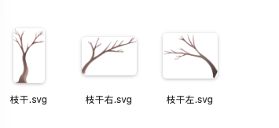
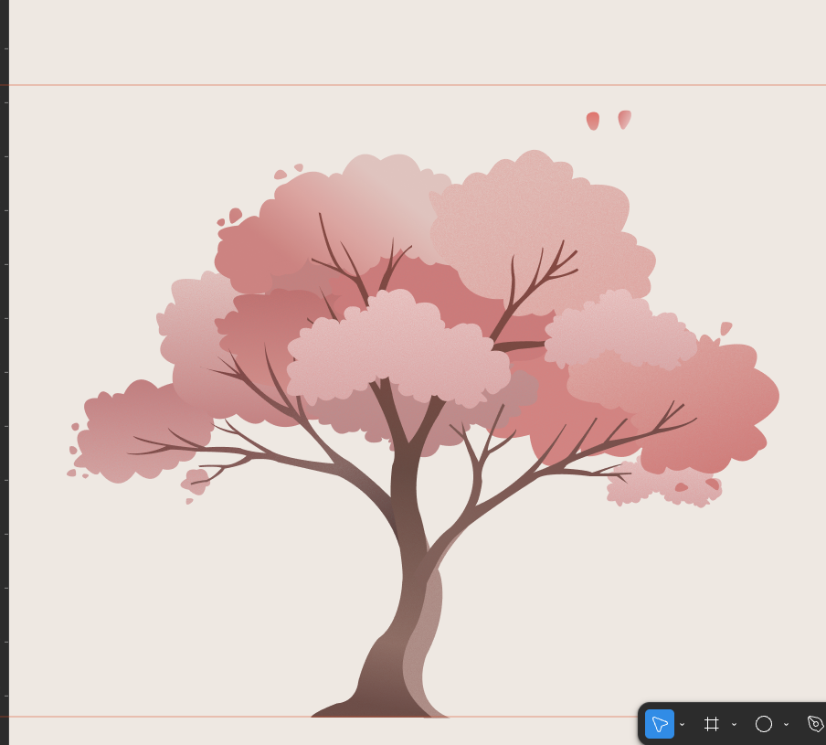

# 要求  
关于这块，我现在有个任务要交给你，就是我要做一个这个树，它很自然的就是那种随风摇曳，然后它上面的那个枝干摇摆震颤，然后上面它的树冠也是那种很自然摆动的那种小动画。然后并且，还会伴伴随着一些花瓣的一个很自然的一个随风的一个飘落  
关于技术的选型，然后已经在这里可以看一下这个文件夹里，我们最终定的是使用一个骨骼动画方式，因为可能后期能够做到更加自然的一个样感觉，就是技术，你完全可以参照目前我这个实验品使用的方法。然后它大致的一个摇摆效果也是很不错的。但是，希望就是能够做得更加细致，就是每一个相当于树冠之间摇摆的一个不同，但是都要符合韵律，还有树枝之间一个自然的一个摆动，就希望可以呈现一个更精致的一个效果  
[growth-experiment-sway-bones.html](Attachments/E35288E6-0231-48AE-9C7B-96A7A8F06A18.html)  
然后关于这个树干的一个摆动，因为我不知道要想让树干摆动得越自然越细好，你需要的是3个，这个枝干要拆开，还是整个一整个，所以我就都放到这个文件夹里头了。你可以看到，就是拆开的3个枝干，还有一整个枝干，这个你可以根据一个具体的需求进行选取  
  
  
  
然后，关于飘落的花瓣，我专门画了两个。你可以以它们为蓝本进行就是复制。然后，飘落的花瓣可以对它们进行比如说大小的一些变化，让它们看起来别那么一致，像多种不同的，飘落的那种动画的一个样式和感觉，你可以看这个动画，在最后花瓣飘落的时候，我觉得能达到这个效果就非常顶呱呱了  
  
  
嗯，然后关于这个物体的位置，你和那个大小之间的关系，你可以参考整值。同时，嗯，使用微博玛插件，然后进到我这个飞马画板上面，然后你可以看到我画了两个花瓣，它的和具体这个数的一个大概的大小的关系，还有整个数具体的一个数据数值  
  
然后一定注意的铁律Figma 里我只复刻了整个风格，但是画的尺寸可能和目前的（设计稿）不一致。      
"精确数值"也需要根据实际尺寸调整的情况。  
我希望这一次在你有已经有原有的一个成功的一个技术。的一个支持，还有我给你的一个参考的情况下，你能一次大概成型出来一个摆动很自然，然后页面往下落，也很自然的一整个一个看起来非常闲适真实的一个树的一个动画  
