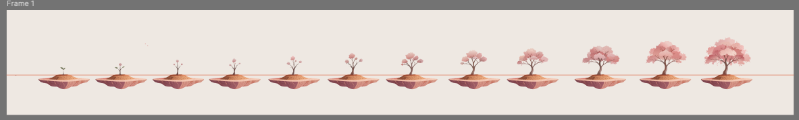
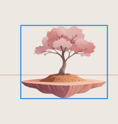

# 要求2  
  
  
关于这里，现在这个任务往下走了，就我们现在做完这个完整的任务，一切就结束了。然后我现在说一下，就之前要求看第一个要求文档，我当时选中了，就是倒数第三棵树，也就是10 里头那棵树，然后我把它打包成了一个叫树最终，树中的一个文件，因为当时它是最后一棵树。然后让你做了一下树的摆动，然后评价是是很 ok 的，就是这里没有任何问题。然后唯一觉得这个树 有问题的可能就是右边的一个，左边的一个支叉，这个位置。应该是在后，是在那个中间之差的后面，你改到了前面。然后第二点是所有我加了那个噪点的，原图里头其实噪点是很细腻的，只是有一点点质感，但是你这个给我弄的非常粗糙，所以需要把噪点点整体我的要求是要整个细腻一点，有一丢丢质感，但是不要和没加噪点的看起来分别那么大。  
  
  
本来是想让你改这个，但是现在树扩张了，我之前画了四棵，然后现在相当于是画有了十二棵树，然后每一棵树都要做这样的一个，相当于自然的一个摆动吧。所以我现在给你打包了十二个文件夹。然后我的一个初步的想法就是相当于你可以继续在现有的 HTML 里头做。就是底下可以加一些可以选择的、那个点击的序号从1到12。然后我点击到哪个就是哪一个树的一个自然的一个状态，然后它们的一个状态和现在的要求是一样的，也就是说非常自然，像在真实自然环境中，它可能会有的一些，就是那种摇摆。然后只有从第五棵树开始，就是会去飘小花瓣。然后前面的那几株是不飘花瓣的，就是不要有，现在这个飘散花瓣的一个东西，或者就是你可以，我觉得这个花瓣的这个可以有一个开关，就是想去给哪一棵树，让它去飘散花瓣，就可以打开那个开关，然后就可以开启那个功能，关掉的话就没有任何花瓣往下飘，只是一个就是自然摇摆的一个树。  
  
然后你可以看到就是，关于底部它有一个那个悬浮台，是因为这个东西它相当于是要放在 APP 上，所以就是底下肯定要有一个就是承载树的一个东西。当然这个台子没有什么大的那个动效，主要的自然的摆动其实是上面的植物。然后 然后整体就是带植物，带这个台子，它因为是浮空城嘛，悬浮的。可以有点就是那种很轻微很自然的那种，就是磁悬浮，它肯定有个那种上下的一个很小幅度的那种漂浮感。可以把这个整体的这个 动效做出来，那样我觉得会更精致一点。然后就是各自数的一个摆动，它们是用那个按钮可以切换的，从1到12。然后  
  
有一点需要说的，就是这里我比较，我不知道该怎么弄的，我不确定的是，就是原本那个最终数，也就是现在 HTML 里头现有的一个，我觉得无需重做，可以去改，因为那个数还在，它是这一颗。倒数第三颗，也就是文件夹10里头的一个内容。但是有一个问题就是，它现在在这整个飞鸽码文件的位置上，我不是把它往后移了嘛。所以我不知道就是你在测算会不会用原本的那个，叫那个树中的那个里头的文文件包的东西，会不会位置就是出现偏移。因为要放那个浮空城，所以我就重新相当于把这个内容又打包了一个，叫是那个文件 加10。这个里头的内容是绝对是完全一致的。我觉得你可以根据那个，结合这个旧版和新版，你去看一下。就我的需求是要完整，位置绝对不能去偏移。该给你的我就全部给你。你我，你了解我的意思就行。就是这棵树不用重做，但是因为我在画，Figma 上把位置调整了，所以我害怕你读原本的位置会出现偏移，所以我给你打包了一个全新的，你可以看着。就怎么运用现有的那个东西，然后去读取新的位置，还是怎么弄。反正达到我的要求就行。  
  
OK，然后大部分内容其实我该说的已经说完了。然后包括数值还是，因为我不确定，想让你做到特别舒适的一个动效，就是那个，现在那个数，HTML 它那个动效就很舒服，很 OK 。你那个树，枝干需不需要拆分成中左 左右三组动会更自然，所以我就既把拆分的给了你，然后整体的树干都给了你。也就是说我把我能给的都给了。具体怎么做到我要求的，这个就是看你去运用我的那个，我给你的所有内容，然后用你的技术去达到。标准就行了。  


然后关于具体的那个位置，你直接进到figma里头就可以读取到。就我每一个具体的数值，然后我每个还给了一个整整体在里头，你一定要保证出来的整个位置是不能错位的，因为我又给你了整体 然后你必须去我的figma里读取那个精确数值。然后做的话，根据同，做出来的那个 html 同比例进行一个测算，缩小或者放大。我不知道大小完全一致不，反正最终要求就是，你要把它的整个位置是。不能出现任何跑偏。  
